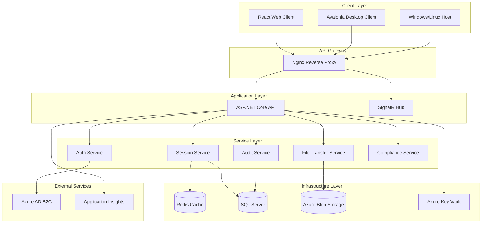
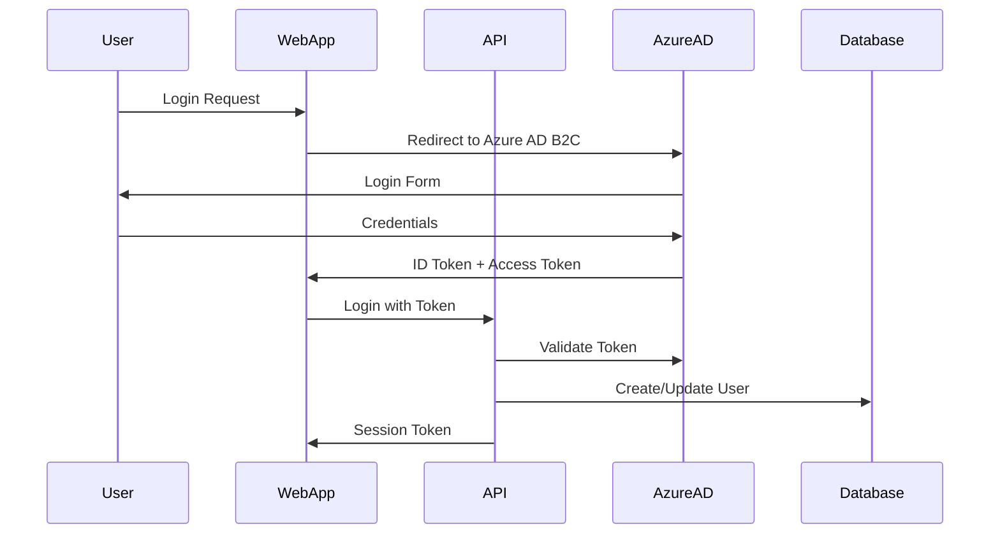
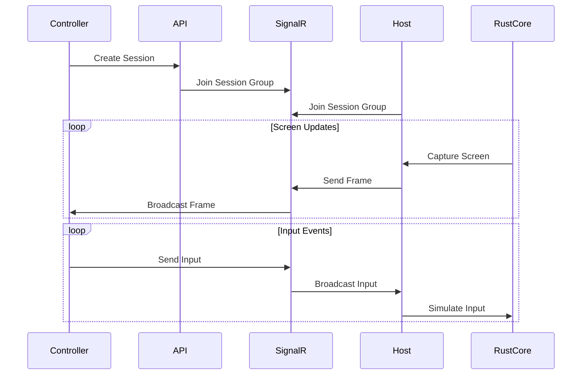
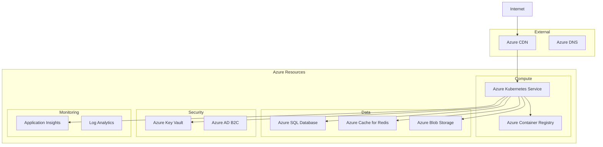

# RemoteC Architecture Documentation

## Table of Contents
1. [Overview](#overview)
2. [System Architecture](#system-architecture)
3. [Component Architecture](#component-architecture)
4. [Data Flow](#data-flow)
5. [Security Architecture](#security-architecture)
6. [Deployment Architecture](#deployment-architecture)
7. [Technology Stack](#technology-stack)

## Overview

RemoteC is an enterprise-grade remote control solution designed for secure, high-performance remote desktop access. The system follows a microservices architecture pattern with clear separation of concerns between frontend, backend, and core performance components.

### Key Architectural Principles
- **Microservices Architecture**: Loosely coupled services with well-defined interfaces
- **Security First**: End-to-end encryption, Azure AD B2C authentication, and comprehensive audit logging
- **Performance Optimized**: Rust core engine for screen capture and video encoding
- **Cloud Native**: Containerized deployment with Kubernetes support
- **Enterprise Ready**: Multi-tenancy, RBAC, compliance features (SOC2, HIPAA, GDPR)

## System Architecture



## Component Architecture

### 1. Frontend Components

#### React Web Client (`src/RemoteC.Web`)
- **Technology**: React 18, TypeScript, Material-UI, Vite
- **Key Features**:
  - Real-time remote desktop viewing
  - Session management dashboard
  - File transfer interface
  - Admin controls for user/device management
- **State Management**: React Context API
- **Real-time Communication**: SignalR client

#### Avalonia Desktop Client (`src/RemoteC.Client`)
- **Technology**: Avalonia UI, .NET 8, C#
- **Key Features**:
  - Cross-platform desktop application
  - Native performance
  - System tray integration
  - Local settings management
- **Architecture**: MVVM pattern with ReactiveUI

### 2. Backend Components

#### API Server (`src/RemoteC.Api`)
- **Technology**: ASP.NET Core 8.0
- **Architecture Patterns**:
  - Repository Pattern for data access
  - Service Layer for business logic
  - Dependency Injection throughout
- **Key Services**:
  - **SessionService**: Manages remote control sessions
  - **UserService**: User management and permissions
  - **FileTransferService**: Chunked file transfers
  - **AuditService**: Comprehensive audit logging
  - **ComplianceService**: HIPAA, SOC2, GDPR compliance

#### SignalR Hub (`src/RemoteC.Api/Hubs`)
- **Purpose**: Real-time bidirectional communication
- **Features**:
  - Mouse/keyboard input streaming
  - Screen update notifications
  - Session status updates
  - Chat messaging
- **Groups**: Sessions are organized into SignalR groups

### 3. Host Component (`src/RemoteC.Host`)
- **Technology**: .NET 8, Windows/Linux specific APIs
- **Architecture**:
  - Provider pattern for remote control backends
  - Currently uses ControlR provider
  - Future: Custom Rust provider via FFI
- **Key Services**:
  - **ScreenCaptureService**: Screen capture coordination
  - **InputControlService**: Mouse/keyboard input simulation
  - **SessionManager**: Local session state management

### 4. Core Performance Engine (`src/RemoteC.Core`)
- **Technology**: Rust
- **Features**:
  - Native screen capture (Windows/Linux/macOS)
  - Hardware-accelerated video encoding (H.264/H.265)
  - QUIC transport protocol
  - FFI bindings for .NET interop
- **Architecture**:
  ```
  capture/ - Platform-specific screen capture
  encoding/ - Video codec implementations
  transport/ - Network protocol handling
  ffi/ - Foreign function interface for .NET
  ```

## Data Flow

### 1. Authentication Flow


### 2. Remote Session Flow


### 3. File Transfer Flow
- Chunked upload/download for reliability
- Resume support for interrupted transfers
- Progress tracking via SignalR
- Temporary storage in Azure Blob Storage

## Security Architecture

### 1. Authentication & Authorization
- **Primary Auth**: Azure AD B2C with MFA support
- **Secondary Auth**: PIN-based quick access (time-limited)
- **Authorization**: Role-Based Access Control (RBAC)
- **Permissions**: Granular permission system

### 2. Encryption
- **Transport Security**: TLS 1.3 for all communications
- **End-to-End Encryption**: ChaCha20-Poly1305 for session data
- **Key Management**: Azure Key Vault for secrets
- **Data at Rest**: SQL Server TDE, encrypted blob storage

### 3. Audit & Compliance
- **Audit Logging**: Every action logged with context
- **Compliance Features**:
  - HIPAA: PHI access tracking, consent management
  - SOC2: Security controls, access reviews
  - GDPR: Data retention, right to be forgotten
- **Session Recording**: Optional encrypted session recordings

## Deployment Architecture

### 1. Container Architecture
```yaml
Services:
- API: ASP.NET Core in Linux container
- Web: React app served by Nginx
- Host: Platform-specific containers
- Redis: Official Redis Alpine image
- SQL Server: Azure SQL or containerized SQL Server
```

### 2. Kubernetes Deployment
- **Namespace Isolation**: Separate namespaces per environment
- **Service Mesh**: Optional Istio integration
- **Ingress**: Nginx ingress controller
- **Secrets**: Kubernetes secrets with Azure Key Vault integration
- **Scaling**: Horizontal Pod Autoscaling for API pods

### 3. Cloud Architecture (Azure)


## Technology Stack

### Backend
- **Runtime**: .NET 8.0
- **Framework**: ASP.NET Core
- **Real-time**: SignalR
- **ORM**: Entity Framework Core
- **Database**: SQL Server (stored procedures only)
- **Cache**: Redis
- **Message Queue**: Azure Service Bus (future)

### Frontend
- **Web Framework**: React 18
- **Language**: TypeScript
- **UI Library**: Material-UI / shadcn/ui
- **Build Tool**: Vite
- **State Management**: Context API
- **Real-time**: SignalR client

### Desktop
- **Framework**: Avalonia UI
- **Language**: C# 12
- **Pattern**: MVVM with ReactiveUI
- **Platform**: Cross-platform (Windows, Linux, macOS)

### Performance Core
- **Language**: Rust
- **Video Encoding**: FFmpeg, Hardware acceleration
- **Transport**: QUIC protocol
- **Concurrency**: Tokio async runtime

### Infrastructure
- **Containers**: Docker
- **Orchestration**: Kubernetes
- **CI/CD**: GitHub Actions
- **Monitoring**: Application Insights, OpenTelemetry
- **Cloud**: Azure (primary), AWS/GCP compatible

### Development
- **Version Control**: Git
- **Package Management**: NuGet, npm, Cargo
- **Testing**: xUnit, Jest, Rust test framework
- **Code Quality**: SonarQube, ESLint, Clippy

## Performance Considerations

### 1. Latency Optimization
- Target: <50ms end-to-end latency
- QUIC protocol for reduced round trips
- Hardware-accelerated encoding
- Adaptive bitrate based on network conditions

### 2. Scalability
- Horizontal scaling for API servers
- Redis for distributed session state
- CDN for static assets
- Database connection pooling

### 3. Resource Efficiency
- Rust core for minimal CPU/memory usage
- Efficient video codecs (H.265 preferred)
- Delta encoding for screen updates
- Compression for file transfers

## Future Architecture Enhancements

### Phase 2 (Rust Performance Engine)
- Complete replacement of ControlR provider
- Native performance optimization
- Advanced video encoding pipeline

### Phase 3 (Enterprise Features)
- Multi-region deployment
- Advanced policy engine
- Machine learning for anomaly detection
- Blockchain audit trail (optional)

## Conclusion

RemoteC's architecture is designed to be secure, scalable, and performant while maintaining flexibility for future enhancements. The microservices approach allows independent scaling and deployment of components, while the clear separation of concerns enables parallel development and easy maintenance.