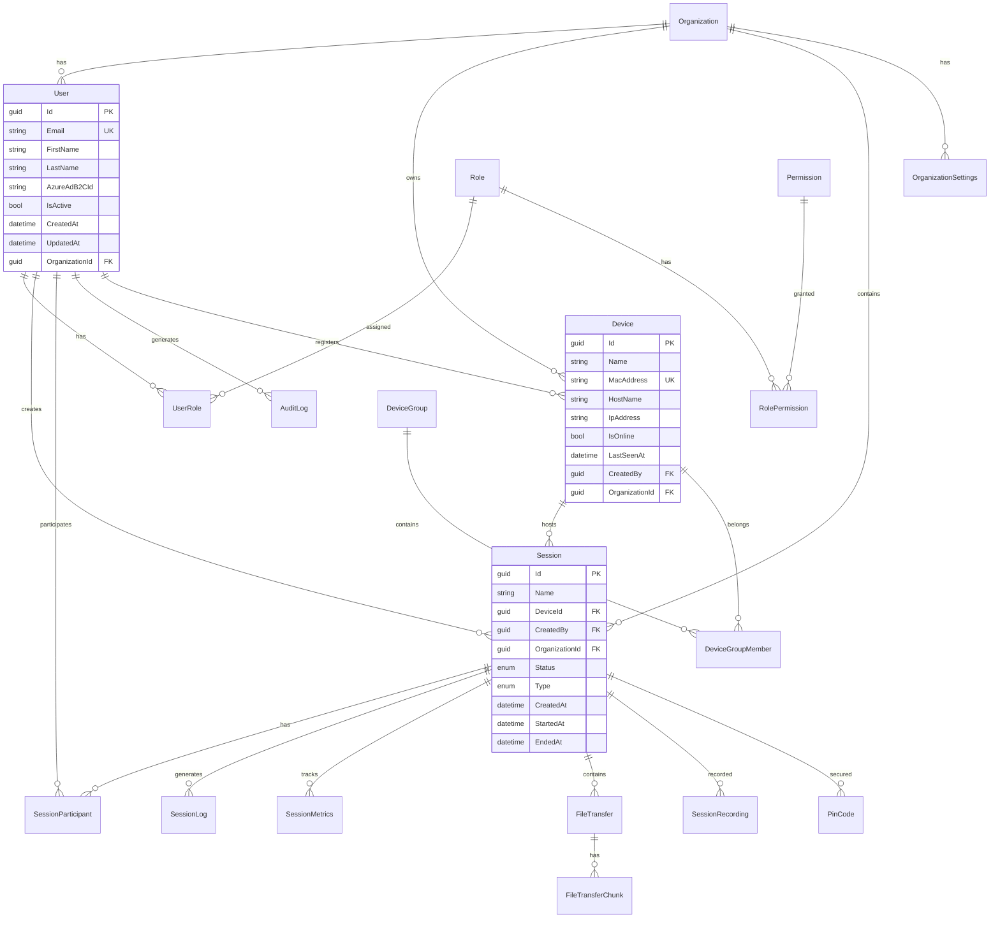

# RemoteC Database Architecture

## Overview

The RemoteC database is designed with security, performance, and scalability in mind. All database access is performed through stored procedures, providing an additional security layer and enabling database-level optimization.

## Database Design Principles

1. **Stored Procedures Only**: No direct table access from application code
2. **Normalized Design**: 3NF normalization with strategic denormalization
3. **Audit Trail**: Comprehensive auditing of all data changes
4. **Soft Deletes**: Logical deletion with IsDeleted flags
5. **Temporal Data**: CreatedAt, UpdatedAt timestamps on all tables
6. **GUID Primary Keys**: UUID v4 for distributed compatibility

## Entity Relationship Diagram



## Core Tables

### 1. User Management

#### Users Table
```sql
CREATE TABLE [dbo].[Users] (
    [Id] UNIQUEIDENTIFIER PRIMARY KEY DEFAULT NEWID(),
    [Email] NVARCHAR(255) NOT NULL UNIQUE,
    [FirstName] NVARCHAR(100) NOT NULL,
    [LastName] NVARCHAR(100) NOT NULL,
    [AzureAdB2CId] NVARCHAR(255) NULL,
    [PhoneNumber] NVARCHAR(50) NULL,
    [IsActive] BIT NOT NULL DEFAULT 1,
    [IsSuperAdmin] BIT NOT NULL DEFAULT 0,
    [CreatedAt] DATETIME2 NOT NULL DEFAULT SYSUTCDATETIME(),
    [UpdatedAt] DATETIME2 NULL,
    [LastLoginAt] DATETIME2 NULL,
    [LastLoginIp] NVARCHAR(45) NULL,
    [Department] NVARCHAR(100) NULL,
    [OrganizationId] UNIQUEIDENTIFIER NULL,
    CONSTRAINT [FK_Users_Organizations] FOREIGN KEY ([OrganizationId]) 
        REFERENCES [Organizations]([Id])
);

-- Indexes
CREATE INDEX [IX_Users_Email] ON [Users]([Email]);
CREATE INDEX [IX_Users_OrganizationId] ON [Users]([OrganizationId]);
CREATE INDEX [IX_Users_AzureAdB2CId] ON [Users]([AzureAdB2CId]) WHERE [AzureAdB2CId] IS NOT NULL;
```

#### Roles and Permissions
```sql
CREATE TABLE [dbo].[Roles] (
    [Id] UNIQUEIDENTIFIER PRIMARY KEY DEFAULT NEWID(),
    [Name] NVARCHAR(100) NOT NULL UNIQUE,
    [Description] NVARCHAR(500) NULL,
    [IsActive] BIT NOT NULL DEFAULT 1,
    [IsSystem] BIT NOT NULL DEFAULT 0,
    [CreatedAt] DATETIME2 NOT NULL DEFAULT SYSUTCDATETIME()
);

CREATE TABLE [dbo].[Permissions] (
    [Id] UNIQUEIDENTIFIER PRIMARY KEY DEFAULT NEWID(),
    [Name] NVARCHAR(100) NOT NULL UNIQUE,
    [Description] NVARCHAR(500) NULL,
    [Resource] NVARCHAR(100) NOT NULL,
    [Action] NVARCHAR(100) NOT NULL,
    [Category] NVARCHAR(100) NULL,
    [IsActive] BIT NOT NULL DEFAULT 1
);

CREATE TABLE [dbo].[UserRoles] (
    [UserId] UNIQUEIDENTIFIER NOT NULL,
    [RoleId] UNIQUEIDENTIFIER NOT NULL,
    [AssignedAt] DATETIME2 NOT NULL DEFAULT SYSUTCDATETIME(),
    [AssignedBy] UNIQUEIDENTIFIER NOT NULL,
    PRIMARY KEY ([UserId], [RoleId])
);
```

### 2. Device Management

```sql
CREATE TABLE [dbo].[Devices] (
    [Id] UNIQUEIDENTIFIER PRIMARY KEY DEFAULT NEWID(),
    [Name] NVARCHAR(255) NOT NULL,
    [HostName] NVARCHAR(255) NULL,
    [IpAddress] NVARCHAR(45) NULL,
    [MacAddress] NVARCHAR(17) NULL,
    [OperatingSystem] NVARCHAR(100) NULL,
    [Version] NVARCHAR(50) NULL,
    [IsOnline] BIT NOT NULL DEFAULT 0,
    [LastSeenAt] DATETIME2 NOT NULL DEFAULT SYSUTCDATETIME(),
    [CreatedAt] DATETIME2 NOT NULL DEFAULT SYSUTCDATETIME(),
    [CreatedBy] UNIQUEIDENTIFIER NOT NULL,
    [RegisteredBy] UNIQUEIDENTIFIER NULL,
    [OrganizationId] UNIQUEIDENTIFIER NULL
);

-- Unique constraint on MAC address per organization
CREATE UNIQUE INDEX [UX_Devices_MacAddress_Org] 
    ON [Devices]([MacAddress], [OrganizationId]) 
    WHERE [MacAddress] IS NOT NULL;
```

### 3. Session Management

```sql
CREATE TABLE [dbo].[Sessions] (
    [Id] UNIQUEIDENTIFIER PRIMARY KEY DEFAULT NEWID(),
    [Name] NVARCHAR(255) NOT NULL,
    [DeviceId] UNIQUEIDENTIFIER NOT NULL,
    [CreatedBy] UNIQUEIDENTIFIER NOT NULL,
    [OrganizationId] UNIQUEIDENTIFIER NOT NULL,
    [Status] INT NOT NULL DEFAULT 0, -- Enum: Created, Active, Ended, etc.
    [Type] INT NOT NULL DEFAULT 0, -- Enum: RemoteControl, ViewOnly, etc.
    [CreatedAt] DATETIME2 NOT NULL DEFAULT SYSUTCDATETIME(),
    [StartedAt] DATETIME2 NULL,
    [EndedAt] DATETIME2 NULL,
    [ConnectionInfo] NVARCHAR(MAX) NULL, -- JSON
    [RequirePin] BIT NOT NULL DEFAULT 1
);

CREATE TABLE [dbo].[SessionParticipants] (
    [Id] UNIQUEIDENTIFIER PRIMARY KEY DEFAULT NEWID(),
    [SessionId] UNIQUEIDENTIFIER NOT NULL,
    [UserId] UNIQUEIDENTIFIER NOT NULL,
    [Role] INT NOT NULL DEFAULT 0, -- Enum: Viewer, Controller, Admin
    [IsConnected] BIT NOT NULL DEFAULT 0,
    [JoinedAt] DATETIME2 NOT NULL DEFAULT SYSUTCDATETIME(),
    [LeftAt] DATETIME2 NULL
);
```

### 4. Audit and Compliance

```sql
CREATE TABLE [dbo].[AuditLogs] (
    [Id] UNIQUEIDENTIFIER PRIMARY KEY DEFAULT NEWID(),
    [Action] NVARCHAR(100) NOT NULL,
    [EntityType] NVARCHAR(100) NULL,
    [EntityId] NVARCHAR(100) NULL,
    [ResourceType] NVARCHAR(100) NOT NULL,
    [ResourceId] NVARCHAR(100) NULL,
    [ResourceName] NVARCHAR(200) NULL,
    [UserId] UNIQUEIDENTIFIER NULL,
    [UserName] NVARCHAR(100) NULL,
    [UserEmail] NVARCHAR(255) NULL,
    [IpAddress] NVARCHAR(45) NULL,
    [UserAgent] NVARCHAR(1000) NULL,
    [OldValues] NVARCHAR(MAX) NULL, -- JSON
    [NewValues] NVARCHAR(MAX) NULL, -- JSON
    [Details] NVARCHAR(MAX) NULL,
    [Metadata] NVARCHAR(MAX) NULL, -- JSON
    [CorrelationId] NVARCHAR(100) NULL,
    [Duration] BIGINT NULL, -- Milliseconds
    [Timestamp] DATETIME2 NOT NULL DEFAULT SYSUTCDATETIME(),
    [Success] BIT NOT NULL DEFAULT 1,
    [ErrorMessage] NVARCHAR(MAX) NULL,
    [OrganizationId] UNIQUEIDENTIFIER NULL,
    [Severity] INT NOT NULL DEFAULT 0,
    [Category] INT NOT NULL DEFAULT 0,
    [IsArchived] BIT NOT NULL DEFAULT 0,
    [ArchivedAt] DATETIME2 NULL
);

-- Partitioned by month for performance
CREATE PARTITION FUNCTION [PF_AuditLogs_Monthly](DATETIME2)
AS RANGE RIGHT FOR VALUES 
('2024-01-01', '2024-02-01', '2024-03-01', /* ... */);

CREATE PARTITION SCHEME [PS_AuditLogs_Monthly]
AS PARTITION [PF_AuditLogs_Monthly]
TO ([PRIMARY], [PRIMARY], [PRIMARY], /* ... */);
```

### 5. File Transfer

```sql
CREATE TABLE [dbo].[FileTransfers] (
    [Id] UNIQUEIDENTIFIER PRIMARY KEY DEFAULT NEWID(),
    [SessionId] UNIQUEIDENTIFIER NOT NULL,
    [UserId] UNIQUEIDENTIFIER NOT NULL,
    [FileName] NVARCHAR(500) NOT NULL,
    [FileHash] NVARCHAR(64) NULL, -- SHA256
    [TotalSize] BIGINT NOT NULL,
    [ChunkSize] INT NOT NULL,
    [TotalChunks] INT NOT NULL,
    [ChunksReceived] INT NOT NULL DEFAULT 0,
    [BytesReceived] BIGINT NOT NULL DEFAULT 0,
    [Direction] INT NOT NULL, -- Upload/Download
    [Status] INT NOT NULL, -- InProgress/Completed/Failed/Cancelled
    [StoragePath] NVARCHAR(1000) NULL,
    [ErrorMessage] NVARCHAR(MAX) NULL,
    [CreatedAt] DATETIME2 NOT NULL DEFAULT SYSUTCDATETIME(),
    [UpdatedAt] DATETIME2 NULL,
    [CompletedAt] DATETIME2 NULL
);

CREATE TABLE [dbo].[FileTransferChunks] (
    [TransferId] UNIQUEIDENTIFIER NOT NULL,
    [ChunkIndex] INT NOT NULL,
    [Data] VARBINARY(MAX) NOT NULL,
    [Hash] NVARCHAR(64) NOT NULL,
    [ReceivedAt] DATETIME2 NOT NULL DEFAULT SYSUTCDATETIME(),
    PRIMARY KEY ([TransferId], [ChunkIndex])
);
```

## Stored Procedures

### Naming Convention
- `sp_[Entity]_[Action]`
- Examples: `sp_User_Create`, `sp_Session_GetById`, `sp_Device_UpdateStatus`

### Common Stored Procedure Patterns

#### 1. CRUD Operations
```sql
-- Create
CREATE PROCEDURE [dbo].[sp_User_Create]
    @Email NVARCHAR(255),
    @FirstName NVARCHAR(100),
    @LastName NVARCHAR(100),
    @AzureAdB2CId NVARCHAR(255) = NULL,
    @OrganizationId UNIQUEIDENTIFIER = NULL
AS
BEGIN
    SET NOCOUNT ON;
    
    DECLARE @Id UNIQUEIDENTIFIER = NEWID();
    
    INSERT INTO [Users] (
        [Id], [Email], [FirstName], [LastName], 
        [AzureAdB2CId], [OrganizationId]
    )
    VALUES (
        @Id, @Email, @FirstName, @LastName, 
        @AzureAdB2CId, @OrganizationId
    );
    
    -- Return the created user
    SELECT * FROM [Users] WHERE [Id] = @Id;
END;
```

#### 2. Complex Queries
```sql
CREATE PROCEDURE [dbo].[sp_Session_GetWithParticipants]
    @SessionId UNIQUEIDENTIFIER
AS
BEGIN
    SET NOCOUNT ON;
    
    -- Get session details
    SELECT * FROM [Sessions] WHERE [Id] = @SessionId;
    
    -- Get participants
    SELECT 
        p.*,
        u.[Email] AS UserEmail,
        u.[FirstName] + ' ' + u.[LastName] AS UserName
    FROM [SessionParticipants] p
    INNER JOIN [Users] u ON p.[UserId] = u.[Id]
    WHERE p.[SessionId] = @SessionId;
    
    -- Get device info
    SELECT d.*
    FROM [Devices] d
    INNER JOIN [Sessions] s ON s.[DeviceId] = d.[Id]
    WHERE s.[Id] = @SessionId;
END;
```

#### 3. Business Logic
```sql
CREATE PROCEDURE [dbo].[sp_Session_Start]
    @SessionId UNIQUEIDENTIFIER,
    @UserId UNIQUEIDENTIFIER
AS
BEGIN
    SET NOCOUNT ON;
    BEGIN TRANSACTION;
    
    BEGIN TRY
        -- Verify user has permission
        IF NOT EXISTS (
            SELECT 1 FROM [Sessions] 
            WHERE [Id] = @SessionId 
            AND ([CreatedBy] = @UserId OR EXISTS (
                SELECT 1 FROM [SessionParticipants] 
                WHERE [SessionId] = @SessionId 
                AND [UserId] = @UserId 
                AND [Role] >= 1 -- Controller or Admin
            ))
        )
        BEGIN
            RAISERROR('Unauthorized', 16, 1);
            RETURN;
        END;
        
        -- Update session status
        UPDATE [Sessions] 
        SET 
            [Status] = 4, -- Active
            [StartedAt] = SYSUTCDATETIME()
        WHERE [Id] = @SessionId;
        
        -- Log the action
        EXEC [sp_AuditLog_Create] 
            @Action = 'SessionStarted',
            @ResourceType = 'Session',
            @ResourceId = @SessionId,
            @UserId = @UserId;
        
        COMMIT TRANSACTION;
        
        -- Return updated session
        SELECT * FROM [Sessions] WHERE [Id] = @SessionId;
    END TRY
    BEGIN CATCH
        ROLLBACK TRANSACTION;
        THROW;
    END CATCH;
END;
```

## Indexing Strategy

### Primary Indexes
- Clustered index on primary keys (GUIDs)
- Non-clustered indexes on foreign keys

### Performance Indexes
```sql
-- User queries
CREATE INDEX [IX_Users_Email_Active] 
    ON [Users]([Email]) 
    INCLUDE ([FirstName], [LastName], [IsActive])
    WHERE [IsActive] = 1;

-- Session queries
CREATE INDEX [IX_Sessions_Status_Org] 
    ON [Sessions]([Status], [OrganizationId]) 
    INCLUDE ([Name], [CreatedAt]);

-- Audit log queries
CREATE INDEX [IX_AuditLogs_Timestamp_User] 
    ON [AuditLogs]([Timestamp], [UserId]) 
    INCLUDE ([Action], [ResourceType]);
```

### Full-Text Search
```sql
CREATE FULLTEXT CATALOG [FT_Catalog];

CREATE FULLTEXT INDEX ON [AuditLogs]
    ([Action], [Details], [ErrorMessage])
    KEY INDEX [PK_AuditLogs]
    ON [FT_Catalog];
```

## Security Measures

### 1. Row-Level Security
```sql
CREATE FUNCTION [dbo].[fn_SecurityPredicate](@OrganizationId UNIQUEIDENTIFIER)
RETURNS TABLE
WITH SCHEMABINDING
AS
RETURN SELECT 1 AS Result
WHERE 
    @OrganizationId = CAST(SESSION_CONTEXT(N'OrganizationId') AS UNIQUEIDENTIFIER)
    OR IS_ROLEMEMBER('db_owner') = 1;

CREATE SECURITY POLICY [OrgFilter]
ADD FILTER PREDICATE [dbo].[fn_SecurityPredicate]([OrganizationId])
ON [dbo].[Users],
ADD FILTER PREDICATE [dbo].[fn_SecurityPredicate]([OrganizationId])
ON [dbo].[Devices];
```

### 2. Column-Level Encryption
```sql
-- Create master key and certificate
CREATE MASTER KEY ENCRYPTION BY PASSWORD = 'StrongPassword123!';
CREATE CERTIFICATE [RemoteC_Cert] WITH SUBJECT = 'RemoteC Data Encryption';

-- Create symmetric key
CREATE SYMMETRIC KEY [RemoteC_Key]
WITH ALGORITHM = AES_256
ENCRYPTION BY CERTIFICATE [RemoteC_Cert];

-- Encrypt sensitive columns
ALTER TABLE [Users] 
ADD [EncryptedPhoneNumber] VARBINARY(256);

-- Usage in stored procedure
OPEN SYMMETRIC KEY [RemoteC_Key]
DECRYPTION BY CERTIFICATE [RemoteC_Cert];

UPDATE [Users] 
SET [EncryptedPhoneNumber] = EncryptByKey(Key_GUID('RemoteC_Key'), [PhoneNumber]);

CLOSE SYMMETRIC KEY [RemoteC_Key];
```

### 3. Audit Triggers
```sql
CREATE TRIGGER [tr_Users_Audit]
ON [Users]
AFTER INSERT, UPDATE, DELETE
AS
BEGIN
    SET NOCOUNT ON;
    
    DECLARE @Action NVARCHAR(10);
    IF EXISTS (SELECT * FROM inserted) AND EXISTS (SELECT * FROM deleted)
        SET @Action = 'UPDATE';
    ELSE IF EXISTS (SELECT * FROM inserted)
        SET @Action = 'INSERT';
    ELSE
        SET @Action = 'DELETE';
    
    INSERT INTO [AuditLogs] (
        [Action], [EntityType], [EntityId], [OldValues], [NewValues]
    )
    SELECT 
        @Action,
        'User',
        COALESCE(i.[Id], d.[Id]),
        (SELECT * FROM deleted d2 WHERE d2.[Id] = d.[Id] FOR JSON PATH),
        (SELECT * FROM inserted i2 WHERE i2.[Id] = i.[Id] FOR JSON PATH)
    FROM inserted i
    FULL OUTER JOIN deleted d ON i.[Id] = d.[Id];
END;
```

## Performance Optimization

### 1. Partitioning Strategy
- Audit logs partitioned by month
- Session logs partitioned by date
- Old partitions archived to blob storage

### 2. Query Optimization
- Stored procedure execution plans cached
- Statistics updated weekly
- Query hints for complex joins

### 3. Maintenance Jobs
```sql
-- Weekly index maintenance
EXEC sp_MSforeachtable 'ALTER INDEX ALL ON ? REBUILD WITH (ONLINE = ON)';

-- Update statistics
EXEC sp_updatestats;

-- Clean up old sessions
DELETE FROM [Sessions] 
WHERE [Status] = 7 -- Ended
AND [EndedAt] < DATEADD(DAY, -90, SYSUTCDATETIME());
```

## Backup and Recovery

### Backup Strategy
1. **Full Backup**: Weekly on Sunday
2. **Differential Backup**: Daily
3. **Transaction Log Backup**: Every 15 minutes
4. **Geo-redundant Storage**: Azure Backup

### Recovery Procedures
```sql
-- Point-in-time recovery
RESTORE DATABASE [RemoteC2Db]
FROM DISK = 'backup.bak'
WITH NORECOVERY;

RESTORE LOG [RemoteC2Db]
FROM DISK = 'log.trn'
WITH RECOVERY, STOPAT = '2024-01-15 10:30:00';
```

## Monitoring and Alerts

### Key Metrics
- Connection pool usage
- Long-running queries (>5 seconds)
- Deadlock occurrences
- Index fragmentation
- Storage growth rate

### Alert Thresholds
```sql
-- Alert on high connection count
IF (SELECT COUNT(*) FROM sys.dm_exec_connections) > 900
    EXEC msdb.dbo.sp_send_dbmail
        @recipients = 'dba@remotec.com',
        @subject = 'High Connection Count Alert',
        @body = 'Connection count exceeds 900';
```

## Migration Strategy

### Version Control
- All schema changes in numbered migration scripts
- Rollback scripts for each migration
- Migration history tracked in database

### Migration Table
```sql
CREATE TABLE [dbo].[SchemaVersions] (
    [Version] INT PRIMARY KEY,
    [ScriptName] NVARCHAR(255) NOT NULL,
    [Applied] DATETIME2 NOT NULL DEFAULT SYSUTCDATETIME(),
    [AppliedBy] NVARCHAR(100) NOT NULL DEFAULT SUSER_NAME()
);
```

## Future Enhancements

1. **Temporal Tables**: System-versioned temporal tables for automatic history
2. **Graph Database**: Relationship modeling for complex permissions
3. **In-Memory OLTP**: Hot tables in memory for performance
4. **Columnstore Indexes**: Analytics queries on audit logs
5. **Polybase**: External data integration